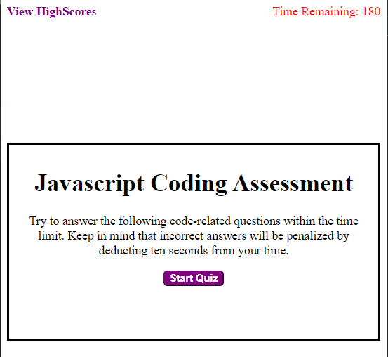

 # Jazascript Coding Assessment

## Description

This is a 5-question assessment to test basic Javascript knowledge.

## Table of Contents

* [Installation](#installation)
* [Usage](#usage)
* [Credits](#credits)
* [License](#license)

## Installation

N/A

## Usage

Hit "Start Quiz" to begin answering questions. 5 questions will appear one after the other. If you answer a question wrong, 5 seconds will be deducted from your time. Once the timer reaches 0 or you answer the last question, you will be able to save your time and name which will appear on a list of "highscores".

Please follow the following link to the quiz!
!(https://gabel35.github.io/JavaScript_Coding_Assessment/)

## Credits

Thank you to all the TA's for your help.

### License

N/A

-------------

Thank you!